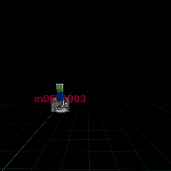

# Project Name ARTargets

## Description

A github repository for an in class demonstration code of AR target images in Unreal.Print out a hardcopy of the image ScanTarget5.png as the target   
 
## Usage
Clone, or download the zip, to a local directory. Open in Unreal Engine 5.3.2 or newer, package for Android to test

## Attributions

